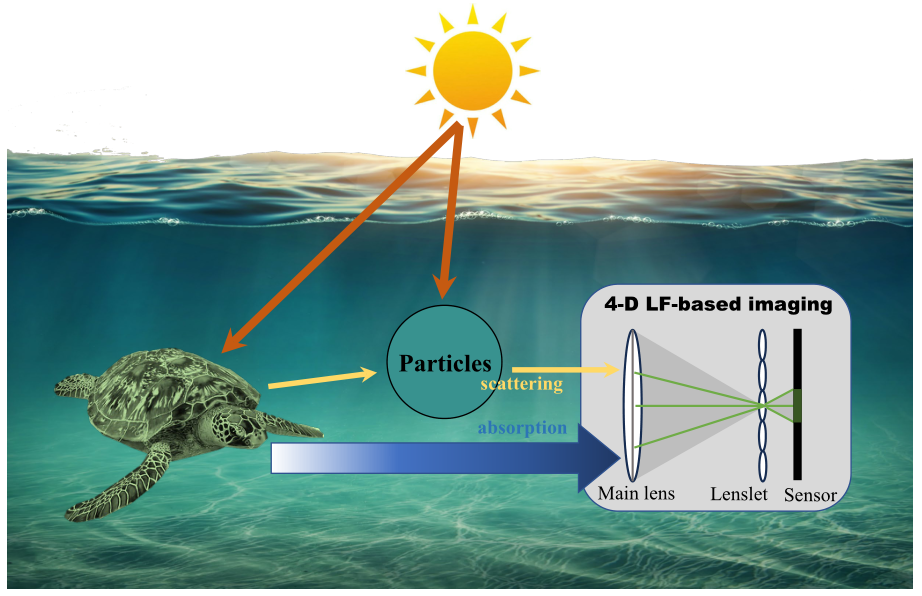
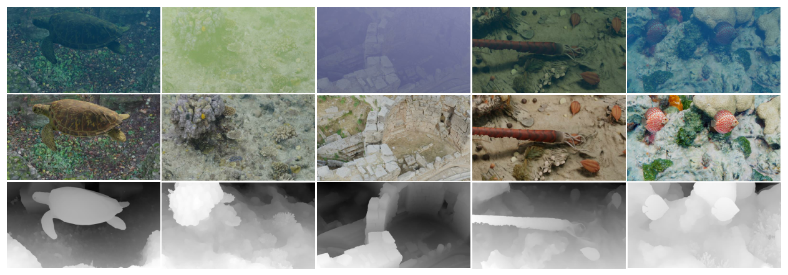

# LFUIE

This repository is the official PyTorch implementation of Enhancing Underwater Imaging with 4-D Light Fields.

[Arxiv](https://arxiv.org/abs/2408.17339)

> In this paper, we delve into the realm of 4-D light fields (LFs) to enhance underwater imaging plagued by light absorption, scattering, and other challenges. Contrasting with conventional 2-D RGB imaging, 4-D LF imaging excels in capturing scenes from multiple perspectives, thereby indirectly embedding geometric information. This intrinsic property is anticipated to effectively address the challenges associated with underwater imaging. By leveraging both explicit and implicit depth cues present in 4-D LF images, we propose a progressive, mutually reinforcing framework for underwater 4-D LF image enhancement and depth estimation. Specifically, our framework explicitly utilizes estimated depth information alongside implicit depth-related dynamic convolutional kernels to modulate output features. The entire framework decomposes this complex task, iteratively optimizing the enhanced image and depth information to progressively achieve optimal enhancement results. More importantly, we construct the first 4-D LF-based underwater image dataset for quantitative evaluation and supervised training of learning-based methods, comprising 75 underwater scenes and 3675 high-resolution 2K pairs. To craft vibrant and varied underwater scenes, we build underwater environments with various objects and adopt several types of degradation. Through extensive experimentation, we showcase the potential and superiority of 4-D LF-based underwater imaging vis-a-vis traditional 2-D RGB-based approaches. Moreover, our method effectively corrects color bias and achieves state-of-the-art performance.
> 
>

  

## Dataset
We build the first 4-D LF-based underwater imaging dataset with diverse degradations and rich scenes, namely LFUB. We use \textit{Blender}, an open-source 3-D modeling and rendering software, to simulate the effects of light propagation in a water medium to achieve as realistic underwater 4-D LF images as possible. This section outlines the construction pipeline of our dataset, including planning scene templates for building simulated environments, establishing degradation conditions that mimic real-world deterioration, and using camera arrays to render LF data. This approach not only serves our current project but also has potential applications in other LF tasks.
>

  

